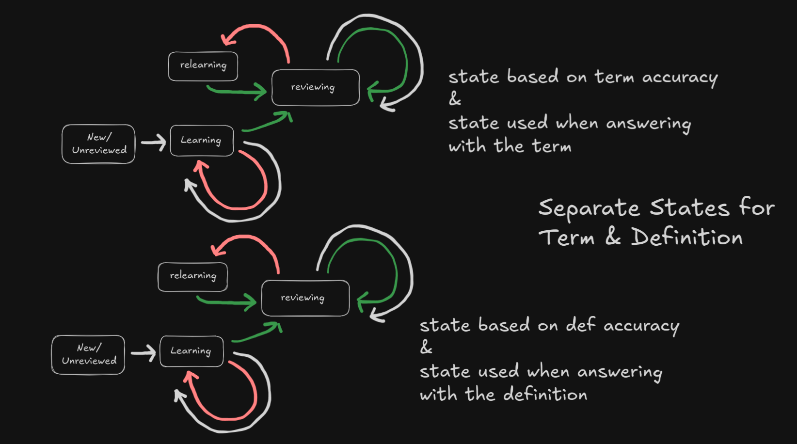

# Review Mode

## Term States

Each terms has a "state" that determines how often it's shown and what effect changes in accuracy has on it's frequency and stuff. 

These states are "new", "learning", "in review", or "relearning".


Term states are seperate for each terms' term and definition.


## Data Structure

Quizfreely stores studysets' terms in a (rectangular) 2D array:
```json
{
    terms: [
        ["term 1", "definition 1"],
        ["term 2", "def 2"],
        ["term 3", "def 3"]
    ]
}
```

Multiple users can review the same studyset, but they will all have different progress, so progress/accuracy/scores are a different array.

Answering with a term and answering with a definition might require a different process or different skills depending on what a user is studying, so Quizfreely records answering-with-term and answering-with-def accuracy seperately.
```json
{
    "termProgress": [
        {
            "term": "term 1",
            "def": "definition 1",
            "termCorrect": 1,
            "termIncorrect": 6,
            "defCorrect": 1,
            "defIncorrect": 0,
            "termState": "learning",
            "defState": "review",
            "confusedTerms": [{
                "term": "term 2",
                "count": 4
            }, {
                "term": "term 3",
                "count": 2
            }],
            "confusedDefs": []
            "firstReviewedAt": "2009-01-19 Jan W4-1 Mon 00:59 GMT-5 EST",
            "lastReviewedAt": "2025-01-19 Jan W3-1 Mon 00:59 GMT-5 EST"
        },
        {
            "term": "term 3",
            "def": "def 3",
            "termCorrect": 9,
            "termIncorrect": 4,
            "defCorrect": 8,
            "defIncorrect": 2,
            "termState": "relearning",
            "defState": "review",
            "confusedTerms": [{
                "term": "term 1",
                "count": 4
            }],
            "confusedDefs": [{
                "def": "definition 1",
                "count": 2
            }]
            "firstReviewedAt": "2022-12-13 Dec W50-2 Tue 16:23 GMT-5 EST"
            "lastReviewedAt": "2025-04-24 Apr W17-4 Thu 22:12 GMT-4 EDT"
        }
    ]
}
```
